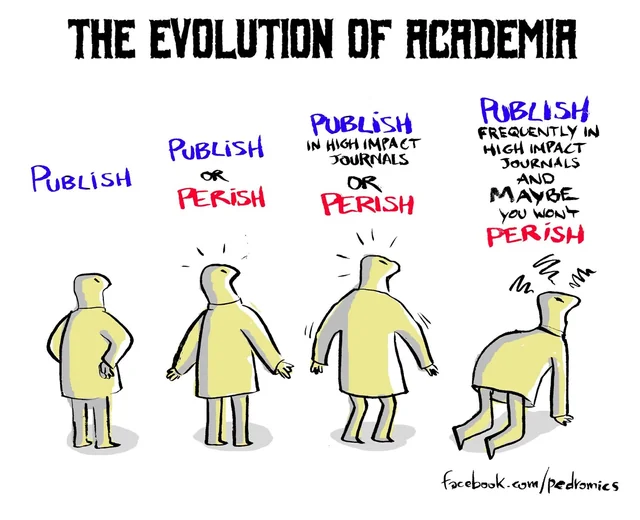
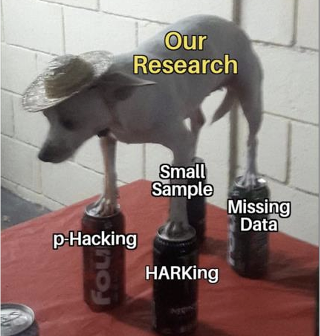
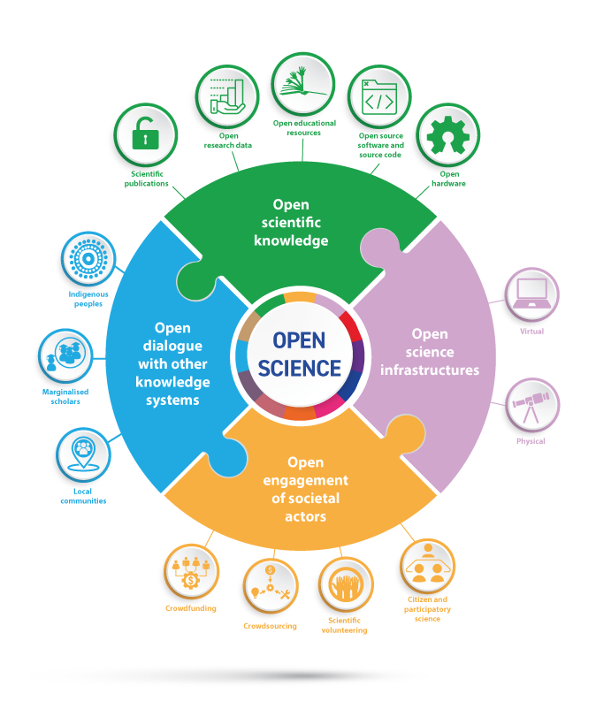
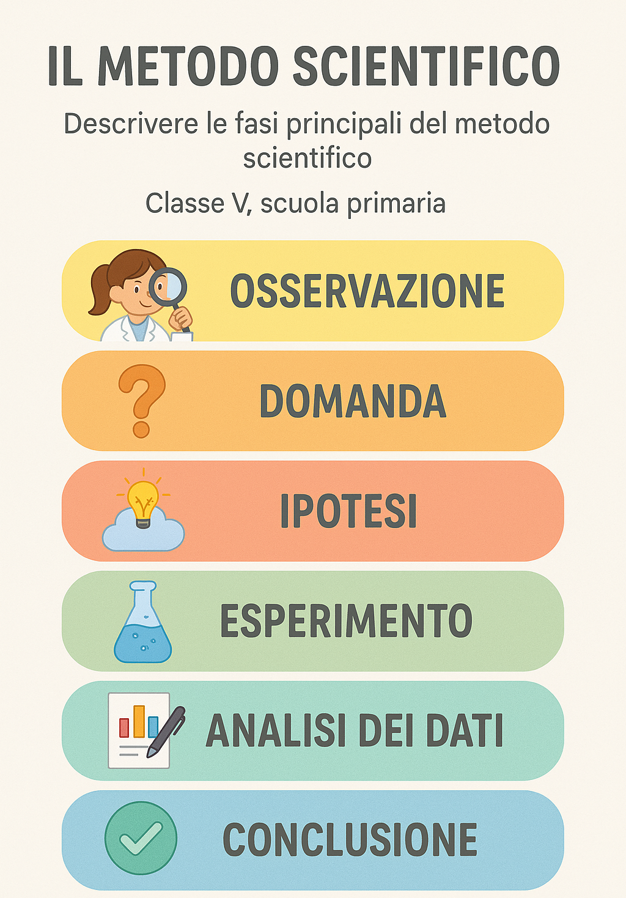
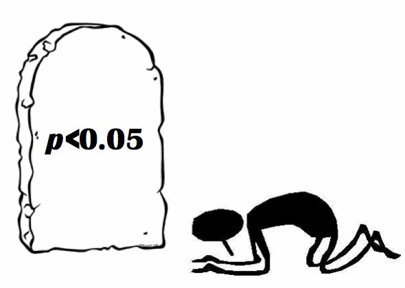

##  {.unlisted background-color="#e7e7ff" auto-animate="true"}

::: {style="margin-top: 100px; color: #ce4993;"}
Open Science
:::

##  {.unlisted background-color="#e7e7ff" auto-animate="true" transition="zoom"}

::: {style="margin-top: 200px; font-size: 3em; color: #ce4993;"}
Open Science
:::

Approccio **collaborativo** e **trasparente** alla ricerca scientifica che rende i risultati - pubblicazioni, dati, software e metodi — accessibili a tutti, in ogni fase del processo.

```{r}
#| echo: false

rm(list=ls())

```

# **Origini: Un grosso Problema!**

-   E' un movimento nato in risposta alla **"Replication Crisis"**

## Bias di Pubblicazione {.unlisted auto-animate="true"}

Le riviste pubblicano solo risultati **positivi** ed **esaltanti**

## Bias di Pubblicazione {auto-animate="true"}

\

Questo porta i ricercatori a mettere in atto cattive pratiche di ricerca per poter avanzare di carriera

\

Le riviste pubblicano solo risultati positivi ed esaltanti

## **Publish or Perish**

::::: columns
::: {.column width="60%"}
Come si possono fare pubblicazioni di qualità se c'è tutta questa pressione?
:::

::: {.column width="40%"}
{.absolute top="0" width="400" height="400" right="0"} {.absolute bottom="50" width="320" height="320" left="60"}
:::
:::::

# **Pratiche** {transition="zoom"}

## Cattive Pratiche {.smaller}

In risposta alle pressioni "ambientali" i ricercatori hanno messo in atto un metodo di sopravvivenza che include:

-   **P-hacking** → Manipolazione dei dati o delle analisi raccolte per ottenere un P-value significativo

```{r }
#| output-location: column
#| echo: true
#| code-line-numbers: "|4,5|8"

set.seed(1)

# 1. Simula dati (due gruppi senza vera differenza)
g1 <- rnorm(30, mean = 500, sd = 50)
g2 <- rnorm(30, mean = 505, sd = 50)

# 2. Test iniziale (non significativo)
t.test(g1, g2)

```

::: {style="text-align: center; color:grey;"}
Com'è possibile che non sia significativo? Deve esserci stato qualche problema!
:::

##  {.smaller}

```{r}
#| output-location: column
#| echo: true
#| code-line-numbers: "|2,3|6"

# 3. "P-hacking": rimuovo valori che ostacolano la significatività
g1_ph <- g1[g1 < 550]   # tolgo outlier alti
g2_ph <- g2[g2 > 460]   # tolgo valori bassi

# 4. Nuovo test (ora spesso significativo)
t.test(g1_ph, g2_ph)
```

::: {style="text-align: center; color:grey;"}
Ecco! Qualcuno si è addormentato e qualcuno andava a caso, eliminare qualcosa è stata la cosa **giusta**.
:::

## Altri Problemi {.smaller}

::::: columns
::: {.column .incremental width="60%"}
-   **HARKing** → Hipothesizing after results are known

-   **Salami slicing** → Dividere un singolo studio in diverse pubblicazioni per ottenere più citazioni

-   Scarsa formazione in ambito statistico: **analisi statistiche deboli**

-   Assenza di **Power Analysis**[^1]: perchè vogliamo un campione con n partecipanti?
:::

::: {.column width="40%"}
{.absolute bottom="200" width="300" height="300" right="40"}
:::
:::::

[^1]: metodo statistico usato per determinare la sample size minima per ottenere un effetto significativo

## Buone Pratiche 

Tutte le pratiche **OPEN** :

-   Registered Reports e Pre-registrazioni

-   Depositi pubblici per dati e materiali

-   Riviste accessibili

{.absolute bottom="210" width="200" height="200" right="60"}

{.absolute bottom="460" width="320" height="100" right="0"}

{.absolute bottom="20" right="300" width="350" height="400"}

## 

{.fragment .absolute transition="fade-in" bottom="70" width="400" height="600" right="350"}

##  {background-gradient="radial-gradient(#e7e7ff, #ff9bb9)"}

::: footer
Grazie dell'attenzione
:::

Per informazioni:

noemi.veronese\@studenti.unipd.it

::: r-stack
{.fragment .absolute bottom="80" left="180" width="350"} 

{.fragment .absolute bottom="40" left="180" width="350"} 

{.fragment .absolute bottom="40" left="180" width="350"}
:::
